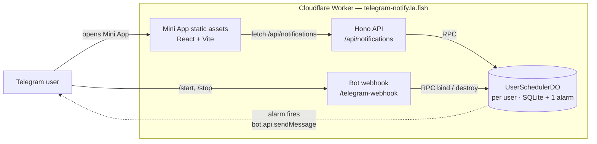
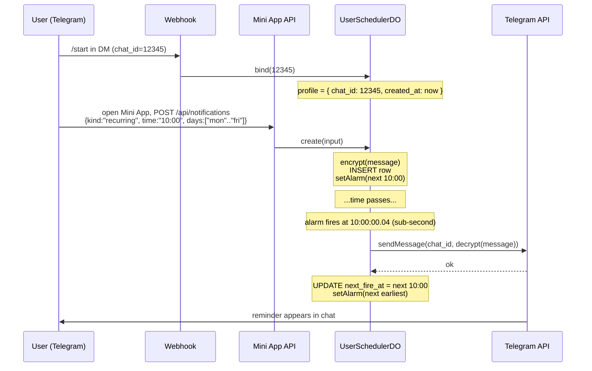

# telegram-notify

Telegram reminder bot — daily / weekday-set / one-time notifications.

A single Cloudflare Worker serves the API (Hono), the bot webhook (grammY),
and the React Mini App (Cloudflare Workers Static Assets). Reminder firing
is owned by `UserSchedulerDO` — one Cloudflare Durable Object per Telegram
user, holding that user's notifications in DO SQLite and a single alarm
slot pointing at the earliest pending fire. Messages are encrypted at the
application layer (AES-256-GCM).

> Replaced the legacy redis/bullmq/k8s `sleepy-notify` deployment, then later
> replaced its own D1 + every-minute cron driver with per-user DO alarms
> (sub-second precision instead of 30–90s cron lag).

## Architecture

### Components



A single Worker hosts everything. `USER_SCHEDULER` is a Durable Object
namespace; each Telegram user hashes deterministically to one DO instance
via `idFromName('user:${telegramUserId}')`. That DO owns the user's
notifications table, profile (chat_id), and exactly one alarm slot pointing
at `MIN(next_fire_at)` over the table.

### Lifecycle of a reminder



For storage internals, see [`docs/database.md`](docs/database.md). For
encryption, see [`docs/encryption.md`](docs/encryption.md).

## Stack

|            |                                                                             |
| ---------- | --------------------------------------------------------------------------- |
| Runtime    | Cloudflare Workers (single deploy)                                          |
| Storage    | Per-user Durable Object SQLite (`drizzle-orm/durable-sqlite` + drizzle-kit) |
| Backend    | Hono, valibot, grammY, vitest + @cloudflare/vitest-pool-workers             |
| Frontend   | React 19, Vite, TanStack Router/Query/Form, valibot                         |
| Encryption | AES-256-GCM (Web Crypto), per-record IV                                     |

## Layout

```
src/                      Worker — API, bot, scheduler
  api/                    Hono routes + middleware
  telegram/               grammY webhook + commands
  scheduler/user-do/      UserSchedulerDO class, schema, time math, mappers
  lib/                    crypto, logger, errors
web/                      React Mini App (Bun workspace)
  src/
    routes/               ListPage, FormPage, PrivacyPage
    components/           per-component folders
    api/                  fetch client + TanStack Query hooks + form↔API mappers
    lib/                  Telegram SDK hooks, form schema, time helpers
    styles/               shared CSS modules
migrations/               drizzle-kit generated SQL + meta snapshots (DO SQLite)
scripts/                  bot config (set-webhook, set-commands)
docs/                     topical guides — see AGENTS.md
.github/workflows/        CI + manual deploy with environment approval
```

## Setup

```bash
bun install

# Secrets — both .env (local) and Worker secrets must agree.
cp .env.example .env
# edit .env to fill BOT_TOKEN, WEBHOOK_SECRET, MESSAGE_KEY (32-byte base64)
bunx wrangler secret put BOT_TOKEN
bunx wrangler secret put WEBHOOK_SECRET
bunx wrangler secret put MESSAGE_KEY

# Generate a fresh MESSAGE_KEY:  openssl rand -base64 32

# Deploy + register the bot webhook + slash commands
bun run deploy
bun run set-webhook
bun run bot:set-commands
```

A staging environment exists at `telegram-notify-staging.la.fish` with its
own bot and DO namespace. Push staging secrets with `--env staging` and use
the `*:staging` package scripts (`deploy:staging`, `set-webhook:staging`, …)
for any operation against staging.

## Local dev

```bash
bun run dev:web    # Vite on :5173 (React HMR)
bun run dev        # wrangler dev on :8787 (DO + secrets)
```

Vite proxies `/api`, `/telegram-webhook`, and `/health` to wrangler.
For real Telegram testing, expose Vite via a Cloudflare Tunnel and register
the tunnel URL on a _dev_ bot (don't repoint the prod webhook).

## API

All requests authenticate via `Authorization: tma <initData>` header.
Wire format speaks `days: WeekDay[]`; bitmasks live only in storage.

| Method | Path                     | Body                                                                  | Response                    |
| ------ | ------------------------ | --------------------------------------------------------------------- | --------------------------- |
| GET    | `/api/notifications`     | —                                                                     | `{ items: Notification[] }` |
| POST   | `/api/notifications`     | `{ kind, time, timezone, message, days?, date? }` (variant on `kind`) | `{ notification }` (201)    |
| PATCH  | `/api/notifications/:id` | partial of POST body                                                  | `{ notification }`          |
| DELETE | `/api/notifications/:id` | —                                                                     | `{ ok: true }`              |
| GET    | `/health`                | —                                                                     | `{ status: "ok" }`          |
| POST   | `/telegram-webhook`      | Telegram update (validated by `x-telegram-bot-api-secret-token`)      | grammY response             |

## Bot commands

| Command  | Effect                                                                                                                                 |
| -------- | -------------------------------------------------------------------------------------------------------------------------------------- |
| `/start` | Bind your `chat_id` to your `UserSchedulerDO` profile (idempotent). Clears stale per-chat menu overrides; removes old reply keyboards. |
| `/stop`  | `userDO.destroy()` — clears profile, deletes all rows, unsets the alarm.                                                               |

## Deployment + CI

`.github/workflows/ci.yml` is the single CI/CD workflow:

- **Verify** runs on every push to `main`, on every pull request, and as the
  first job of every manual deploy. Runs `typecheck`, backend `vitest`, and
  frontend `vitest`.
- **Deploy** runs only on `workflow_dispatch` (manual trigger), depends on
  Verify passing, and uses a GitHub Environment (`staging` or `prod`) with
  required-reviewer protection — so the deploy job pauses for explicit
  approval after Verify is green.

To deploy: GitHub Actions → **CI** → **Run workflow** → pick env → submit →
approve when prompted.

Required GitHub config (one-time):

- Repo secret: `CLOUDFLARE_API_TOKEN` with `Workers Scripts:Edit` permission.
- Environments `staging` and `prod` with **Required reviewers** = yourself.

Local `bun run deploy` still works for ad-hoc deploys; CI is the
strict-by-default path.

## Operational notes

- **Atomic deploy** — `bun run deploy` builds the React app and ships it
  with the Worker in one transaction. There is no cron scheduler to interrupt.
- **Encryption** — `message` field is encrypted with `MESSAGE_KEY` before
  insert; reads decrypt strictly (no plaintext fallback). Rotation requires
  a re-encrypt migration script.
- **Alarm precision** — observed sub-second on production traffic; an order
  of magnitude better than Cloudflare cron's 30–90s top-of-hour latency
  (which the previous design suffered from).
- **Privacy policy** — served at `/privacy` (React route). URL is registered
  in BotFather under Bot Settings → Privacy Policy. Forks should update the
  contact email in `web/src/routes/PrivacyPage.tsx`.
- **DST** — recurrence times shift ±1h around DST transitions twice a year.
  `Intl.DateTimeFormat` handles tz math correctly; the user's `time` string
  stays anchored to local clock.

## License

MIT — see [LICENSE](LICENSE).

## Further reading

- `AGENTS.md` — entry point for AI agents (Cursor, Aider, Codex, Claude Code, …).
- `docs/database.md` — per-user DO storage shape, schema, migrations.
- `docs/encryption.md` — AES-GCM threat model and storage format.
- `docs/telegram-bot.md` — bot config, webhook secret pitfall, menu button hierarchy.
- More topical docs land in `docs/` as needed; see `AGENTS.md` for the index.
