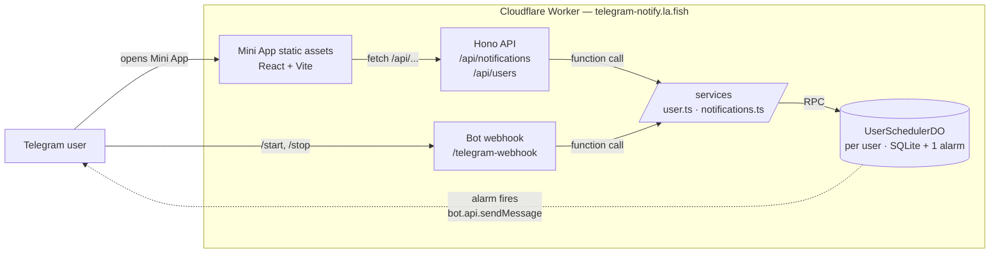
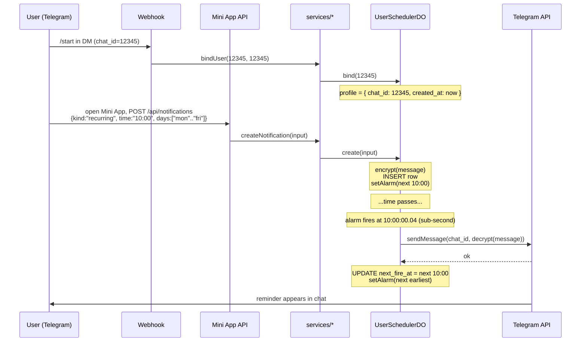

<div align="center">

# telegram-notify

Telegram reminder bot with a Telegram Mini App.

[](https://github.com/idarlafish/telegram-notify/actions/workflows/ci.yml)


</div>

## Overview

A self-hosted reminder bot for Telegram, deployed as a single Cloudflare Worker.

**What it does:**

- recurring reminders (daily or custom weekday sets)
- one-time reminders
- a Telegram Mini App for managing them visually
- AES-256-GCM encryption of reminder content at rest

**Why this stack:**

- **Telegram's Bot API has no scheduled messages** — the original constraint that made this project necessary. Any reminder bot has to run its own scheduler.
- **Sub-second precision** — alarms fire from per-user Durable Objects, not a 30–90s polling cron
- **Zero external dependencies** — Cloudflare Workers + Durable Objects + Telegram are the entire runtime. No Redis, no queue, no third-party scheduler
- **Single atomic deploy** — backend, frontend (Mini App), and storage migrations ship together
- **Fork-friendly** — designed to run on your own Cloudflare account and your own bot

## Architecture

### Components



### Lifecycle of a reminder



## Stack

| Layer      | Stack                                                                                                                                                                                                                                                                                                             |
| ---------- | ----------------------------------------------------------------------------------------------------------------------------------------------------------------------------------------------------------------------------------------------------------------------------------------------------------------- |
| Runtime    |                                                                                                         |
| Storage    |                                                                                                                        |
| Backend    |                                           |
| Frontend   |     |
| Encryption |                                                                                                                                                                     |

## Setup

```bash
bun install

cp .env.example .env
# fill in BOT_TOKEN, WEBHOOK_SECRET, MESSAGE_KEY, CLOUDFLARE_ACCOUNT_ID,
# WEBHOOK_URL, VITE_PRIVACY_CONTACT_EMAIL — see .env.example for each.

bunx wrangler login
bunx wrangler secret put BOT_TOKEN
bunx wrangler secret put WEBHOOK_SECRET
bunx wrangler secret put MESSAGE_KEY

bun run deploy
bun run set-webhook
```

Generate a fresh `MESSAGE_KEY` with `openssl rand -base64 32`.

For staging, fill the `STAGING_BOT_TOKEN` / `STAGING_WEBHOOK_SECRET` / `STAGING_MESSAGE_KEY` / `STAGING_WEBHOOK_URL` block in `.env`, push them with `--env staging`, then `bun run deploy:staging` and `bun run set-webhook:staging`.

## Local development

```bash
bun run dev:web    # Vite on :5173 (React HMR)
bun run dev        # wrangler dev on :8787 (DO + secrets)
```

Useful checks:

```bash
bun run typecheck
bun run test
bun run test:web
```

## API

| Method | Path                     | Body                                                                  | Response                               |
| ------ | ------------------------ | --------------------------------------------------------------------- | -------------------------------------- |
| GET    | `/api/notifications`     | —                                                                     | `{ items: Notification[] }`            |
| POST   | `/api/notifications`     | `{ kind, time, timezone, message, days?, date? }` (variant by `kind`) | `{ notification }`                     |
| PATCH  | `/api/notifications/:id` | partial of POST body                                                  | `{ notification }`                     |
| DELETE | `/api/notifications/:id` | —                                                                     | `{ ok: true }`                         |
| GET    | `/api/users/me`          | —                                                                     | `{ profile: { chat_id, created_at } }` |
| DELETE | `/api/users/me`          | — (destroys all your data)                                            | `{ ok: true }`                         |
| GET    | `/health`                | —                                                                     | `{ status: "ok" }`                     |
| POST   | `/telegram-webhook`      | Telegram update (validated by `x-telegram-bot-api-secret-token`)      | grammY response                        |

## Bot commands

| Command  | Effect                                                                       |
| -------- | ---------------------------------------------------------------------------- |
| `/start` | Bind your `chat_id` to your `UserSchedulerDO` profile (idempotent).          |
| `/stop`  | `userDO.destroy()` — clears profile, deletes all rows, and unsets the alarm. |
